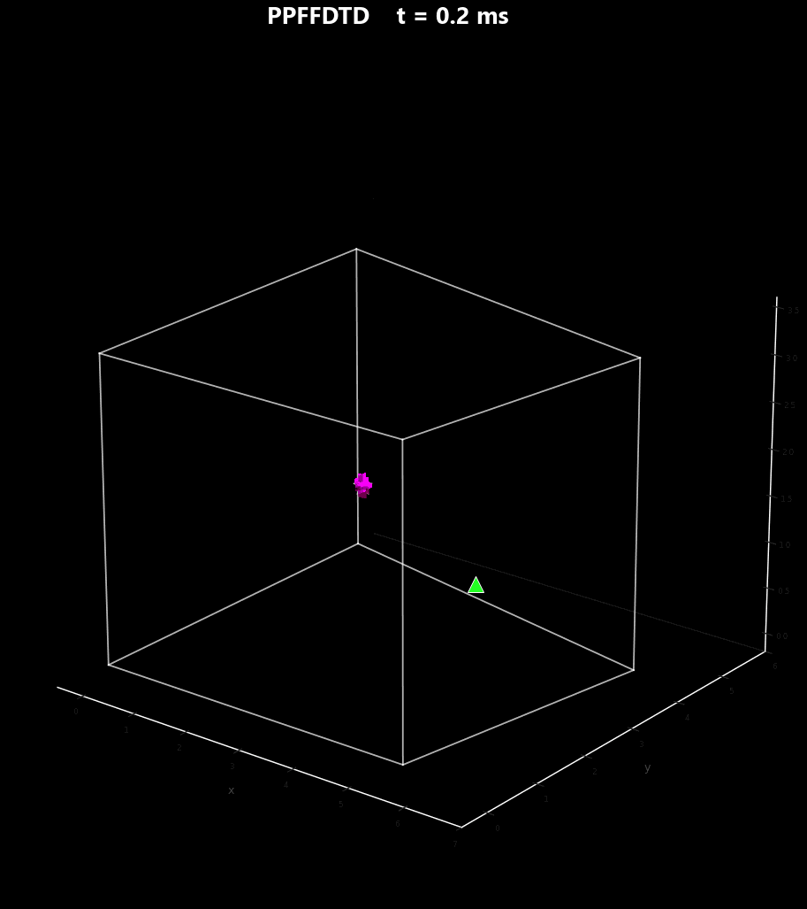
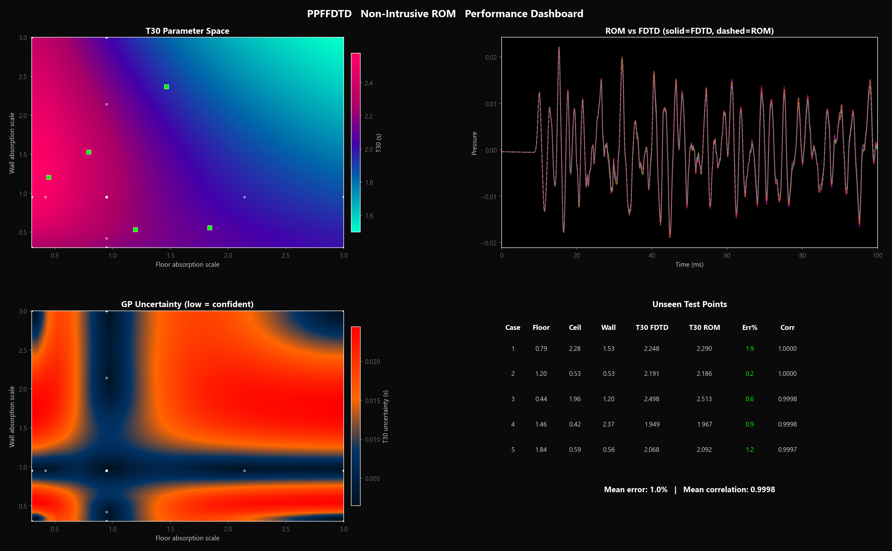
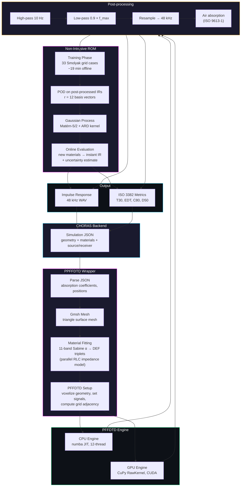

# PPFFDTD

Python wrapper for [PFFDTD](https://github.com/bsxfun/pffdtd) (Brian Hamilton, MIT) with a non-intrusive reduced order model. Integrates with [CHORAS](https://github.com/choras-org/CHORAS) for room acoustics simulation.

Linked project: [romacoustics](https://github.com/Burhanuddin98/Reduced-Order-Modelling-SL) (Laplace-domain ROM for room acoustics)



## What it does

Takes a room geometry (.geo/.msh) and surface absorption coefficients, runs a finite-difference time-domain (FDTD) wave simulation, and returns an impulse response with ISO 3382 metrics. An optional reduced order model provides instant re-evaluation when materials change.



## Architecture



## Technical specifications

| Component | Detail |
|-----------|--------|
| **Wave solver** | PFFDTD — 7-point Cartesian FDTD with frequency-dependent impedance boundaries (parallel RLC IIR filters, 11 branches per surface) |
| **Boundary model** | One-sided materials, staircase surface-area correction, first-order ABC at grid edges |
| **Grid** | Automatic voxelization from triangle mesh via ray-triangle intersection |
| **Source signal** | Differentiated Hann window (dhann30) — zero DC content, stable in double precision |
| **GPU backend** | CuPy RawKernel — fused air stencil, boundary filter, ABC, source/receiver kernels. 2.7× speedup on grids > 1M voxels (RTX 2060) |
| **Post-processing** | Butterworth HP/LP filters (zero-phase), Kaiser resampling to 48 kHz, ISO 9613-1 air absorption |
| **ROM type** | Non-intrusive (black-box) — PFFDTD is never modified |
| **ROM training** | Smolyak sparse grid level 2 in 3D (floor/ceiling/walls absorption scale), 33 configurations |
| **ROM basis** | POD on post-processed 48 kHz IRs, r = 12 vectors, 99.99% energy |
| **ROM interpolation** | Gaussian Process regression, Matérn-5/2 kernel with automatic relevance determination |
| **ROM accuracy** | LOO correlation 0.9997, unseen-point T30 error 1.0% mean |
| **Training cost** | 33 × 35s = 19 min (CPU) |
| **Online cost** | < 1 ms per material evaluation |

## CHORAS integration

Implements the `SimulationMethod` interface from [choras-org/simulation-backend](https://github.com/choras-org/simulation-backend).

```python
# CHORAS calls this automatically via Docker
from PFDTDInterface import PFDTDMethod
method = PFDTDMethod()
method.run_simulation("path/to/simulation.json")
```

**Settings** (in the CHORAS JSON `simulationSettings` block):

```json
{
    "pffdtd_c0": 343,
    "pffdtd_fmax": 1000,
    "pffdtd_ppw": 6,
    "pffdtd_ir_length": 1.0,
    "pffdtd_temperature": 20.0,
    "pffdtd_humidity": 50.0,
    "pffdtd_use_gpu": true,
    "pffdtd_use_rom": false,
    "pffdtd_train_rom": false
}
```

Three modes:
1. `use_rom: false, train_rom: false` — full FDTD (~35s CPU, faster on GPU)
2. `use_rom: false, train_rom: true` — full FDTD + train ROM for future use (~19 min)
3. `use_rom: true` — ROM evaluation (< 1 ms, requires prior training)

## Validation

**Wrapper accuracy**: bit-identical to PFFDTD (verified on BRAS S09 benchmark — max diff = 0, correlation = 1.0).

**ROM accuracy on CHORAS MeasurementRoom** (non-rectangular, 6 surfaces, ~89 m³):

| Validation | Correlation | T30 error |
|------------|-------------|-----------|
| Leave-one-out (33 training points) | 0.9997 mean | 2.4% mean |
| 5 unseen FDTD runs | 0.9998 mean | 1.0% mean |

## Repository structure

```
ppffdtd/
├── pffdtd/                     PFFDTD (git submodule, Brian Hamilton, MIT)
├── pffdtd_method/
│   ├── PFDTDInterface.py       CHORAS SimulationMethod interface
│   ├── Dockerfile              Container for CHORAS deployment
│   └── requirements.txt
├── ppffdtd/
│   ├── gpu_engine.py           CuPy RawKernel GPU FDTD engine
│   └── rom.py                  Non-intrusive ROM (Smolyak + GP)
├── common/
│   ├── exampleInput_PFFDTD.json
│   ├── MeasurementRoom.geo     CHORAS test geometry
│   └── MeasurementRoom.msh
├── docs/
│   ├── algorithm.md            PFFDTD algorithm specification
│   ├── rom_dashboard.png
│   └── ppffdtd_3d.gif
├── visualize_3d.py             3D pressure field visualization
├── visualize_rom.py            ROM dashboard generation
└── run_rom_validation.py       ROM training + unseen-point validation
```

## Dependencies

- Python 3.10+
- numpy, scipy, numba, h5py, gmsh, matplotlib, resampy
- scikit-learn (for ROM GP regression)
- CuPy (optional, for GPU acceleration)

## License

MIT (same as PFFDTD)

## Citation

```bibtex
@misc{hamilton2021pffdtd,
  title = {PFFDTD Software},
  author = {Brian Hamilton},
  note = {https://github.com/bsxfun/pffdtd},
  year = {2021}
}
```
