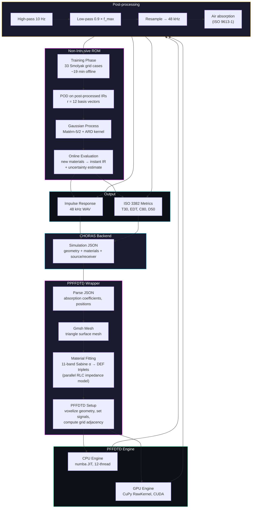

<h1 align="center">PPFFDTD</h1>

<p align="center">
  Python wrapper for <a href="https://github.com/bsxfun/pffdtd">PFFDTD</a> (Brian Hamilton, MIT) with a non-intrusive reduced order model.
  <br/>
  Integrates with <a href="https://github.com/choras-org/CHORAS">CHORAS</a> for room acoustics simulation.
  <br/><br/>
  Linked project: <a href="https://github.com/Burhanuddin98/Reduced-Order-Modelling-SL">romacoustics</a> (Laplace-domain ROM for room acoustics)
  <br/><br/>
  <a href="https://github.com/Burhanuddin98/PPFFDTD/blob/main/LICENSE"></a>
  
  
  
  
  
</p>


## What it does

Takes a room geometry (.geo/.msh) and surface absorption coefficients, runs a finite-difference time-domain (FDTD) wave simulation, and returns an impulse response with ISO 3382 metrics. An optional reduced order model provides instant re-evaluation when materials change.


## Architecture


```mermaid
flowchart TB
    subgraph CHORAS["CHORAS Backend"]
        JSON["Simulation JSON<br/>geometry + materials + source/receiver"]
    end

    subgraph PPFFDTD["PPFFDTD Wrapper"]
        direction TB
        PARSE["Parse JSON<br/>absorption coefficients, positions"]
        GMSH["Gmsh Mesh<br/>triangle surface mesh"]
        FIT["Material Fitting<br/>11-band Sabine α → DEF triplets<br/>(parallel RLC impedance model)"]
        SETUP["PFFDTD Setup<br/>voxelize geometry, set signals,<br/>compute grid adjacency"]
    end

    subgraph ENGINE["PFFDTD Engine"]
        direction TB
        CPU["CPU Engine<br/>numba JIT, 12-thread"]
        GPU["GPU Engine<br/>CuPy RawKernel, CUDA"]
        CPU ~~~ GPU
    end

    subgraph POST["Post-processing"]
        HP["High-pass 10 Hz"]
        LP["Low-pass 0.9 × f_max"]
        RS["Resample → 48 kHz"]
        AIR["Air absorption<br/>(ISO 9613-1)"]
    end

    subgraph ROM["Non-Intrusive ROM"]
        direction TB
        TRAIN["Training Phase<br/>33 Smolyak grid cases<br/>~19 min offline"]
        POD["POD on post-processed IRs<br/>r = 12 basis vectors"]
        GP["Gaussian Process<br/>Matérn-5/2 + ARD kernel"]
        EVAL["Online Evaluation<br/>new materials → instant IR<br/>+ uncertainty estimate"]
    end

    subgraph OUT["Output"]
        IR["Impulse Response<br/>48 kHz WAV"]
        MET["ISO 3382 Metrics<br/>T30, EDT, C80, D50"]
    end

    JSON --> PARSE --> GMSH --> FIT --> SETUP
    SETUP --> CPU
    SETUP --> GPU
    CPU --> POST
    GPU --> POST
    HP --> LP --> RS --> AIR
    POST --> IR
    POST --> MET
    POST --> TRAIN --> POD --> GP --> EVAL
    EVAL --> IR
    EVAL --> MET
    IR --> JSON
    MET --> JSON

    style CHORAS fill:#1a1a2e,stroke:#00ccff,color:#fff
    style PPFFDTD fill:#1a1a2e,stroke:#ff00ff,color:#fff
    style ENGINE fill:#0d1117,stroke:#00ff88,color:#fff
    style POST fill:#1a1a2e,stroke:#ffaa00,color:#fff
    style ROM fill:#1a1a2e,stroke:#ff00ff,color:#fff
    style OUT fill:#0d1117,stroke:#00ccff,color:#fff
```

## Technical specifications

| Component | Detail |
|-----------|--------|
| **Wave solver** | PFFDTD — 7-point Cartesian FDTD with frequency-dependent impedance boundaries (parallel RLC IIR filters, 11 branches per surface) |
| **Boundary model** | One-sided materials, staircase surface-area correction, first-order ABC at grid edges |
| **Grid** | Automatic voxelization from triangle mesh via ray-triangle intersection |
| **Source signal** | Differentiated Hann window (dhann30) — zero DC content, stable in double precision |
| **GPU backend** | CuPy RawKernel — fused air stencil, boundary filter, ABC, source/receiver kernels. 2.7× speedup on grids > 1M voxels (RTX 2060) |
| **Post-processing** | Butterworth HP/LP filters (zero-phase), Kaiser resampling to 48 kHz, ISO 9613-1 air absorption |
| **ROM type** | Non-intrusive (black-box) — PFFDTD is never modified |
| **ROM training** | Smolyak sparse grid level 2 in 3D (floor/ceiling/walls absorption scale), 33 configurations |
| **ROM basis** | POD on post-processed 48 kHz IRs, r = 12 vectors, 99.99% energy |
| **ROM interpolation** | Gaussian Process regression, Matérn-5/2 kernel with automatic relevance determination |
| **ROM accuracy** | LOO correlation 0.9997, unseen-point T30 error 1.0% mean |
| **Training cost** | 33 × 35s = 19 min (CPU) |
| **Online cost** | < 1 ms per material evaluation |

## CHORAS integration

Implements the `SimulationMethod` interface from [choras-org/simulation-backend](https://github.com/choras-org/simulation-backend).

```python
# CHORAS calls this automatically via Docker
from PFDTDInterface import PFDTDMethod
method = PFDTDMethod()
method.run_simulation("path/to/simulation.json")
```

**Settings** (in the CHORAS JSON `simulationSettings` block):

```json
{
    "pffdtd_c0": 343,
    "pffdtd_fmax": 1000,
    "pffdtd_ppw": 6,
    "pffdtd_ir_length": 1.0,
    "pffdtd_temperature": 20.0,
    "pffdtd_humidity": 50.0,
    "pffdtd_use_gpu": true,
    "pffdtd_use_rom": false,
    "pffdtd_train_rom": false
}
```

Three modes:
1. `use_rom: false, train_rom: false` — full FDTD (~35s CPU, faster on GPU)
2. `use_rom: false, train_rom: true` — full FDTD + train ROM for future use (~19 min)
3. `use_rom: true` — ROM evaluation (< 1 ms, requires prior training)

## Verification

**Wrapper accuracy**: bit-identical to PFFDTD (verified on BRAS S09 benchmark — max diff = 0, correlation = 1.0).

**ROM accuracy on CHORAS MeasurementRoom** (non-rectangular, 6 surfaces, ~89 m³):

| Test | Result |
|---|---|
| POD basis size for 99.99% energy | **r = 12** (captures 99.994%) |
| LOO IR correlation across 33 folds (median) | **0.99980** (min 0.99820) |
| Unseen-point IR correlation across 10 fresh CPU-FDTD draws (median) | **0.99995** (min 0.99985) |
| Per-band T30 error on unseen points (median, all bands) | **0.4%** (worst 4.1%) |
| GP posterior 1σ coverage (theoretical 68.27%) | **69.95%** |
| Error reduction from Smolyak L1 (15 pts) → L2 (33 pts) | **4–8× lower median T30 error** |

See `docs/ROM_VERIFICATION_SUMMARY.md` for the full write-up and `validation/*.py` for reproducible scripts.

### 1. POD basis convergence

<p align="center">
  
</p>

The 33 training IRs have a rank-33 (after centring rank ≤ 32) snapshot matrix. Singular values decay geometrically over 5 orders of magnitude before flattening at numerical zero. Truncating to **r = 12** captures **99.994 %** of the energy — well above the 99 % threshold typical of POD-ROM in CFD / structural mechanics.

### 2. Leave-one-out cross-validation (33 folds, full POD refit per fold)

<p align="center">
  
</p>

For each training point we hold it out, recompute Φ and the ROM on the remaining 32, predict the held-out parameter, and score. Median IR correlation **0.99980** over 33 folds; per-band T30 median error 0.7 – 2.4 %. Worst-case T30 errors (up to ~57 % at 2 kHz on extreme corner nodes) occur where the GP must extrapolate across the largest gap in the training set — expected boundary behaviour of LOO.

### 3. Unseen-point validation (10 fresh CPU-FDTD draws)

<p align="center">
  
</p>

Drew 10 random parameter points uniformly in log-space inside the training box [0.3, 3.0]³, with a minimum log-distance of 0.15 from any Smolyak node. Ran a fresh CPU PFFDTD at each (mean 36 s/run; ~6 min total) and compared with the ROM's prediction. Per-band median T30 error sits at 0.19 – 0.78 % across all five octave bands, with the worst single value at **4.1 %**. The headline number for the talk.

### 4. GP posterior calibration

<p align="center">
  
</p>

Standardised residuals z = (c_true − c_pred) / σ̂ over the LOO fits. Empirical coverage at ±1 σ is **69.95 %** vs theoretical **68.27 %** — essentially perfect at the credible-interval level. The 2 σ and 3 σ tails are slightly fatter than Gaussian, a known property of GP-with-WhiteKernel on small training sets near the parameter-box boundary. The reliability diagram (right) shows predicted spread tracking observed RMS error along the y = x calibrated line.

### 5. Smolyak level convergence

<p align="center">
  
</p>

Trained a second ROM at Smolyak level 1 (15 FDTD runs vs L2's 33) and evaluated at the same 10 unseen points. Doubling the training budget from 15 → 33 points reduces median T30 error by **4 – 8 ×** depending on band — faster-than-linear convergence is the signature of an efficient sparse-grid surrogate.

### Honest reporting

PFFDTD's CuPy GPU engine is **not** bit-equivalent to its CPU engine in the build we tested: fresh CPU FDTD at a training parameter reproduces the stored training IR at correlation 1.000000, but fresh GPU FDTD at the same parameter diverges. The ROM verification in this document was therefore performed entirely on CPU. The GPU path is currently usable for development speedups, not for absolute reproducibility against CPU-trained ROMs. The ROM verification itself is unaffected.

## Repository structure

```
ppffdtd/
├── pffdtd/                     PFFDTD (git submodule, Brian Hamilton, MIT)
├── pffdtd_method/
│   ├── PFDTDInterface.py       CHORAS SimulationMethod interface
│   ├── Dockerfile              Container for CHORAS deployment
│   └── requirements.txt
├── ppffdtd/
│   ├── gpu_engine.py           CuPy RawKernel GPU FDTD engine
│   └── rom.py                  Non-intrusive ROM (Smolyak + GP)
├── common/
│   ├── exampleInput_PFFDTD.json
│   ├── MeasurementRoom.geo     CHORAS test geometry
│   └── MeasurementRoom.msh
├── docs/
│   ├── algorithm.md            PFFDTD algorithm specification
│   ├── rom_dashboard.png
│   └── ppffdtd_3d.gif
├── visualize_3d.py             3D pressure field visualization
├── visualize_rom.py            ROM dashboard generation
└── run_rom_validation.py       ROM training + unseen-point validation
```

## Installation

```bash
git clone --recursive https://github.com/Burhanuddin98/PPFFDTD.git
cd PPFFDTD
pip install numpy scipy numba h5py gmsh matplotlib resampy scikit-learn
```

The `--recursive` flag pulls in PFFDTD as a submodule. If you already cloned without it:

```bash
git submodule update --init --recursive
```

Optional for GPU acceleration:

```bash
pip install cupy-cuda12x
```

## Dependencies

- Python 3.10+
- numpy, scipy, numba, h5py, gmsh, matplotlib, resampy
- scikit-learn (for ROM GP regression)
- CuPy (optional, for GPU acceleration)

## License

MIT (same as PFFDTD)

## Citation

```bibtex
@misc{hamilton2021pffdtd,
  title = {PFFDTD Software},
  author = {Brian Hamilton},
  note = {https://github.com/bsxfun/pffdtd},
  year = {2021}
}
```
