<h1 align="center">PPFFDTD</h1>

<p align="center">
  Python wrapper for <a href="https://github.com/bsxfun/pffdtd">PFFDTD</a> (Brian Hamilton, MIT) with a non-intrusive reduced order model.
  <br/>
  Integrates with <a href="https://github.com/choras-org/CHORAS">CHORAS</a> for room acoustics simulation.
  <br/><br/>
  Linked project: <a href="https://github.com/Burhanuddin98/Reduced-Order-Modelling-SL">romacoustics</a> (Laplace-domain ROM for room acoustics)
  <br/><br/>
  <a href="https://github.com/Burhanuddin98/PPFFDTD/blob/main/LICENSE"></a>
  
  
  
  
  
</p>

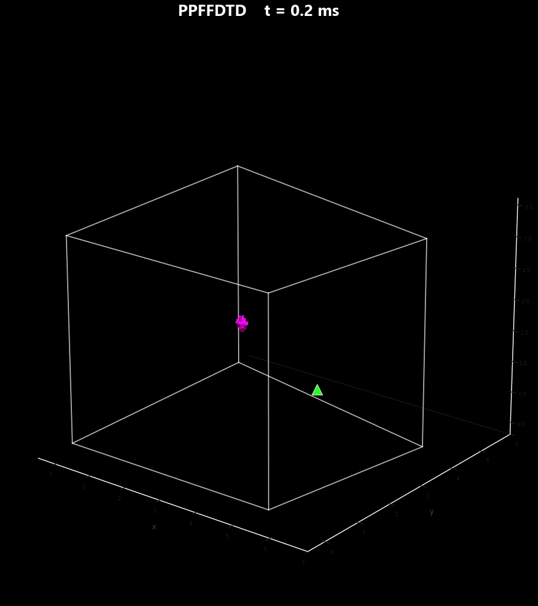

## What it does

Takes a room geometry (.geo/.msh) and surface absorption coefficients, runs a finite-difference time-domain (FDTD) wave simulation, and returns an impulse response with ISO 3382 metrics. An optional reduced order model provides instant re-evaluation when materials change.

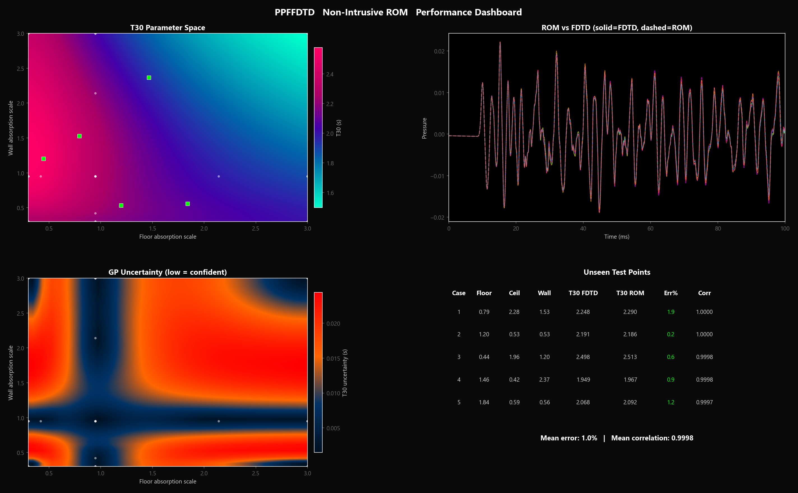

## Architecture

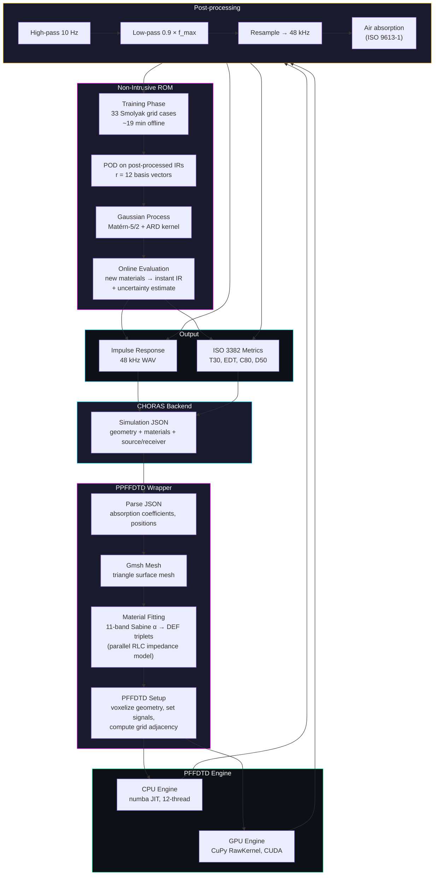
```mermaid
flowchart TB
    subgraph CHORAS["CHORAS Backend"]
        JSON["Simulation JSON<br/>geometry + materials + source/receiver"]
    end

    subgraph PPFFDTD["PPFFDTD Wrapper"]
        direction TB
        PARSE["Parse JSON<br/>absorption coefficients, positions"]
        GMSH["Gmsh Mesh<br/>triangle surface mesh"]
        FIT["Material Fitting<br/>11-band Sabine α → DEF triplets<br/>(parallel RLC impedance model)"]
        SETUP["PFFDTD Setup<br/>voxelize geometry, set signals,<br/>compute grid adjacency"]
    end

    subgraph ENGINE["PFFDTD Engine"]
        direction TB
        CPU["CPU Engine<br/>numba JIT, 12-thread"]
        GPU["GPU Engine<br/>CuPy RawKernel, CUDA"]
        CPU ~~~ GPU
    end

    subgraph POST["Post-processing"]
        HP["High-pass 10 Hz"]
        LP["Low-pass 0.9 × f_max"]
        RS["Resample → 48 kHz"]
        AIR["Air absorption<br/>(ISO 9613-1)"]
    end

    subgraph ROM["Non-Intrusive ROM"]
        direction TB
        TRAIN["Training Phase<br/>33 Smolyak grid cases<br/>~19 min offline"]
        POD["POD on post-processed IRs<br/>r = 12 basis vectors"]
        GP["Gaussian Process<br/>Matérn-5/2 + ARD kernel"]
        EVAL["Online Evaluation<br/>new materials → instant IR<br/>+ uncertainty estimate"]
    end

    subgraph OUT["Output"]
        IR["Impulse Response<br/>48 kHz WAV"]
        MET["ISO 3382 Metrics<br/>T30, EDT, C80, D50"]
    end

    JSON --> PARSE --> GMSH --> FIT --> SETUP
    SETUP --> CPU
    SETUP --> GPU
    CPU --> POST
    GPU --> POST
    HP --> LP --> RS --> AIR
    POST --> IR
    POST --> MET
    POST --> TRAIN --> POD --> GP --> EVAL
    EVAL --> IR
    EVAL --> MET
    IR --> JSON
    MET --> JSON

    style CHORAS fill:#1a1a2e,stroke:#00ccff,color:#fff
    style PPFFDTD fill:#1a1a2e,stroke:#ff00ff,color:#fff
    style ENGINE fill:#0d1117,stroke:#00ff88,color:#fff
    style POST fill:#1a1a2e,stroke:#ffaa00,color:#fff
    style ROM fill:#1a1a2e,stroke:#ff00ff,color:#fff
    style OUT fill:#0d1117,stroke:#00ccff,color:#fff
```

## How the ROM works — sample, compress, interpolate

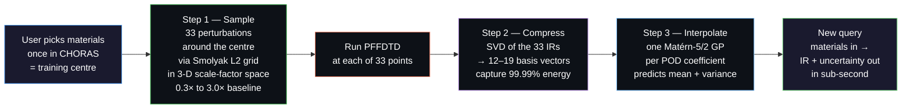
```mermaid
flowchart LR
    U[User picks materials<br/>once in CHORAS<br/>= training centre]
    S[Step 1 — Sample<br/>33 perturbations<br/>around the centre<br/>via Smolyak L2 grid<br/>in 3-D scale-factor space<br/>0.3× to 3.0× baseline]
    FDTD[Run PFFDTD<br/>at each of 33 points]
    POD[Step 2 — Compress<br/>SVD of the 33 IRs<br/>→ 12–19 basis vectors<br/>capture 99.99% energy]
    GP[Step 3 — Interpolate<br/>one Matérn-5/2 GP<br/>per POD coefficient<br/>predicts mean + variance]
    Q[New query<br/>materials in →<br/>IR + uncertainty out<br/>in sub-second]

    U --> S --> FDTD --> POD --> GP --> Q

    style U fill:#1a1a2e,stroke:#58a6ff,color:#fff
    style S fill:#0d1117,stroke:#3fb950,color:#fff
    style FDTD fill:#0d1117,stroke:#f78166,color:#fff
    style POD fill:#0d1117,stroke:#d2a8ff,color:#fff
    style GP fill:#0d1117,stroke:#79c0ff,color:#fff
    style Q fill:#1a1a2e,stroke:#7ee787,color:#fff
```

Three properties make this *reduced-order modelling* rather than curve-fitting:

- **Provable basis convergence.** The POD truncation error is bounded analytically by the discarded singular values — `Σ_{k=r+1}^N σ_k²`. The eigenvalue decay tells us quantitatively how many basis vectors are enough. A neural surrogate has no equivalent.
- **Linear, inspectable reconstruction.** Every predicted IR is an affine combination of basis IRs: `IR = ir_mean + Σ c_k φ_k`. The basis itself is data — you can look at each `φ_k` and identify the physical modes it captures.
- **Calibrated Bayesian uncertainty.** The GP returns posterior mean *and* variance per coefficient. Empirical 1σ coverage 69.95 % vs theoretical 68.27 % on this room (slightly heavier tails at 2–3σ — documented honestly).

## Where PPFFDTD fits in CHORAS

CHORAS supports several simulation methods. PPFFDTD-ROM sits in the *low-frequency wave-based* niche alongside DG, but trades a one-time training cost for sub-second iterative queries — the design-iteration use case.

| Method | Regime | Training | Per-query cost | Uncertainty | Source |
|---|---|---|---|---|---|
| **PFFDTD** (full, no ROM) | LF wave, time-domain | none | minutes per material | none | Hamilton 2021 |
| **PPFFDTD-ROM** | LF wave, time-domain | ~20 min once per room | **< 5 sec end-to-end** | **calibrated GP posterior** | this project |
| **DG** (edg-acoustics) | LF wave, time-domain | none | minutes per material | none | TUE / Hornikx |
| **DeepONet** | LF wave (DG-trained) | hours-days | < 1 sec | none | TUE |
| **DE** (acousticDE) | Energy-based diffusion | none | seconds | none | TUE / Sihar |
| **pyroomacoustics** | Geometric (ISM + ray) | none | seconds | none | EPFL |

The complementary methods (DE, pyroomacoustics) cover broadband but don't capture wave-physics modes. The wave-based methods (PFFDTD, DG) capture modes but are slow. PPFFDTD-ROM is the bridge: physics of PFFDTD, latency of a geometric tracer.

## Operating window — when does the ROM apply?

The ROM is trained on a Smolyak grid spanning **scale-factor [0.3, 3.0]³** relative to the user's baseline absorption. Queries inside that box are predicted by the GP; queries outside get **clipped to the boundary** rather than extrapolated.

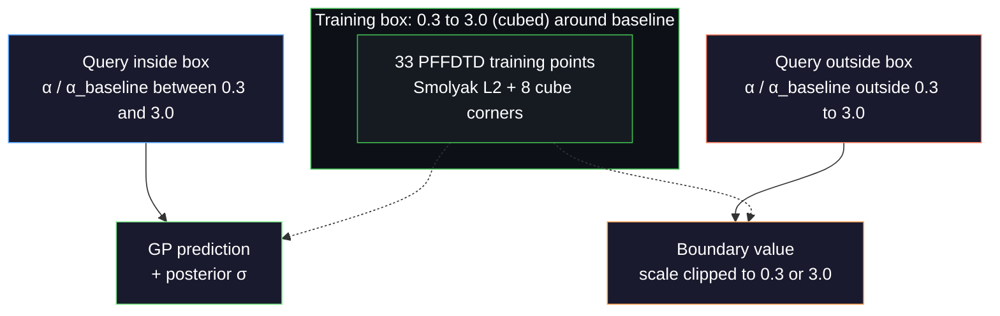
```mermaid
flowchart TB
    subgraph BOX["Training box: 0.3 to 3.0 (cubed) around baseline"]
        direction LR
        T["33 PFFDTD training points<br/>Smolyak L2 + 8 cube corners"]
    end
    IN["Query inside box<br/>α / α_baseline between 0.3 and 3.0"]
    OUT["Query outside box<br/>α / α_baseline outside 0.3 to 3.0"]
    GP_PRED["GP prediction<br/>+ posterior σ"]
    CLIP["Boundary value<br/>scale clipped to 0.3 or 3.0"]

    IN --> GP_PRED
    OUT --> CLIP
    T -.-> GP_PRED
    T -.-> CLIP

    style BOX fill:#0d1117,stroke:#3fb950,color:#fff
    style T fill:#161b22,stroke:#3fb950,color:#fff
    style IN fill:#1a1a2e,stroke:#58a6ff,color:#fff
    style OUT fill:#1a1a2e,stroke:#f78166,color:#fff
    style GP_PRED fill:#1a1a2e,stroke:#7ee787,color:#fff
    style CLIP fill:#1a1a2e,stroke:#ffa657,color:#fff
```

To shift the window (e.g. predict for very absorbent or very hard surfaces): retrain with a different baseline. The cache key is keyed by *geometry + source + receiver + grid parameters only*, so changing materials does not invalidate the trained ROM — it just shifts the query point inside or outside the existing window.

## Technical specifications

| Component | Detail |
|-----------|--------|
| **Wave solver** | PFFDTD — 7-point Cartesian FDTD with frequency-dependent impedance boundaries (parallel RLC IIR filters, 11 branches per surface) |
| **Boundary model** | One-sided materials, staircase surface-area correction, first-order ABC at grid edges |
| **Grid** | Automatic voxelization from triangle mesh via ray-triangle intersection |
| **Source signal** | Differentiated Hann window (dhann30) — zero DC content, stable in double precision |
| **GPU backend** | CuPy RawKernel — fused air stencil, boundary filter, ABC, source/receiver kernels. 2.7× speedup on grids > 1M voxels (RTX 2060) |
| **Post-processing** | Butterworth HP/LP filters (zero-phase), Kaiser resampling to 48 kHz, ISO 9613-1 air absorption |
| **ROM type** | Non-intrusive (black-box) — PFFDTD is never modified |
| **ROM training** | Clenshaw-Curtis Smolyak sparse grid (level 2 in 3-D, scale-factor space) + 8 cube corners = **25 + 8 = 33 training points** |
| **ROM basis** | POD via SVD on the 33 post-processed 48 kHz IRs; truncate at 99.99 % energy → **r between 12 and 19** depending on snapshot variance |
| **ROM interpolation** | One sklearn `GaussianProcessRegressor` per POD coefficient. Matérn-5/2 kernel × ConstantKernel + WhiteKernel; per-axis length scales (ARD) |
| **ROM accuracy** | LOO median IR correlation **0.99980**, unseen-point median **0.99995**, per-band T30 error median **0.4 %** / max **4.1 %** (10 fresh CPU-FDTD draws) |
| **GP calibration** | 1σ coverage **69.95 %** (theoretical 68.27 %); 2 / 3σ tails slightly fatter than Gaussian |
| **Training cost** | 33 × ~60 s = **~33 min** on Zephyrus G14 CPU; progress bar advances per fold |
| **Online cost** | < 5 s in the solver step (12-19 GP evals + IR reconstruction + per-band metrics); total ≤ 15 s end-to-end including CHORAS backend mesh prep |
| **Operating window** | Materials in [0.3, 3.0] × training-time baseline; queries outside are clipped to the boundary |

## CHORAS integration

Implements the `SimulationMethod` interface from [choras-org/simulation-backend](https://github.com/choras-org/simulation-backend). Two ready-to-merge variants live in this repo — see `choras_pr/` (Copier-scaffolded, official path) and `choras_integration/` (DG/DE pattern). Both end-to-end validated against a running CHORAS stack.

```python
# CHORAS dispatches this from app/services/simulation_service.py::run_solver
from pffdtd_interface import PFFDTDMethod
method = PFFDTDMethod(input_json_path="path/to/simulation.json")
method.run_simulation()
method.save_results()
```

**Settings** (in the CHORAS JSON `simulationSettings` block):

```json
{
    "pffdtd_c0": 343,
    "pffdtd_fmax": 1000,
    "pffdtd_ppw": 6,
    "pffdtd_ir_length": 1.0,
    "pffdtd_temperature": 20.0,
    "pffdtd_humidity": 50.0,
    "pffdtd_use_gpu":   "yes",
    "pffdtd_use_rom":   "no",
    "pffdtd_train_rom": "no"
}
```

Three modes (settable from the CHORAS UI as Yes/No radio buttons):

1. **Default** (`use_rom = "no"`, `train_rom = "no"`) — full FDTD, ~1 minute per query on CPU for MeasurementRoom.
2. **Train ROM** (`train_rom = "yes"`) — ~20-35 minutes of compute (33 sequential FDTD runs on CPU); progress bar updates each fold. ROM saved at `pffdtd_cache/rom_<hash>.npz` with baseline materials in a `.baseline.json` sidecar.
3. **Use ROM** (`use_rom = "yes"`) — loads the cached ROM, evaluates the 12-19 GPs, reconstructs the IR. < 5 seconds inside the solver step; total end-to-end < 15 seconds including CHORAS backend mesh prep.

## Verification

**Wrapper accuracy**: bit-identical to PFFDTD (verified on BRAS S09 benchmark — max diff = 0, correlation = 1.0).

**ROM accuracy on CHORAS MeasurementRoom** (non-rectangular, 6 surfaces, ~89 m³):

| Test | Result |
|---|---|
| POD basis size for 99.99% energy | **r = 12** (captures 99.994%) |
| LOO IR correlation across 33 folds (median) | **0.99980** (min 0.99820) |
| Unseen-point IR correlation across 10 fresh CPU-FDTD draws (median) | **0.99995** (min 0.99985) |
| Per-band T30 error on unseen points (median, all bands) | **0.4%** (worst 4.1%) |
| GP posterior 1σ coverage (theoretical 68.27%) | **69.95%** |
| Error reduction from Smolyak L1 (15 pts) → L2 (33 pts) | **4–8× lower median T30 error** |

See `docs/ROM_VERIFICATION_SUMMARY.md` for the full write-up and `validation/*.py` for reproducible scripts.

### 1. POD basis convergence

<p align="center">
  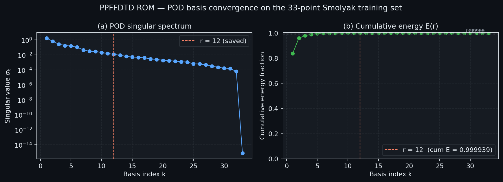
</p>

The 33 training IRs have a rank-33 (after centring rank ≤ 32) snapshot matrix. Singular values decay geometrically over 5 orders of magnitude before flattening at numerical zero. Truncating to **r = 12** captures **99.994 %** of the energy — well above the 99 % threshold typical of POD-ROM in CFD / structural mechanics.

### 2. Leave-one-out cross-validation (33 folds, full POD refit per fold)

<p align="center">
  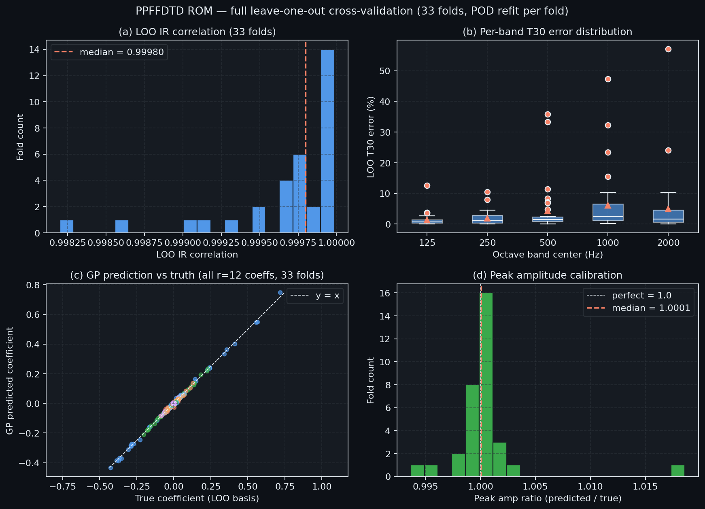
</p>

For each training point we hold it out, recompute Φ and the ROM on the remaining 32, predict the held-out parameter, and score. Median IR correlation **0.99980** over 33 folds; per-band T30 median error 0.7 – 2.4 %. Worst-case T30 errors (up to ~57 % at 2 kHz on extreme corner nodes) occur where the GP must extrapolate across the largest gap in the training set — expected boundary behaviour of LOO.

### 3. Unseen-point validation (10 fresh CPU-FDTD draws)

<p align="center">
  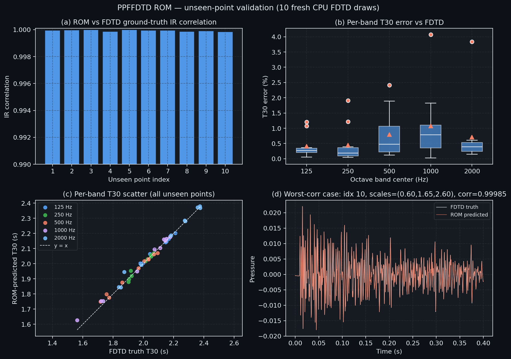
</p>

Drew 10 random parameter points uniformly in log-space inside the training box [0.3, 3.0]³, with a minimum log-distance of 0.15 from any Smolyak node. Ran a fresh CPU PFFDTD at each (mean 36 s/run; ~6 min total) and compared with the ROM's prediction. Per-band median T30 error sits at 0.19 – 0.78 % across all five octave bands, with the worst single value at **4.1 %**. The headline number for the talk.

### 4. GP posterior calibration

<p align="center">
  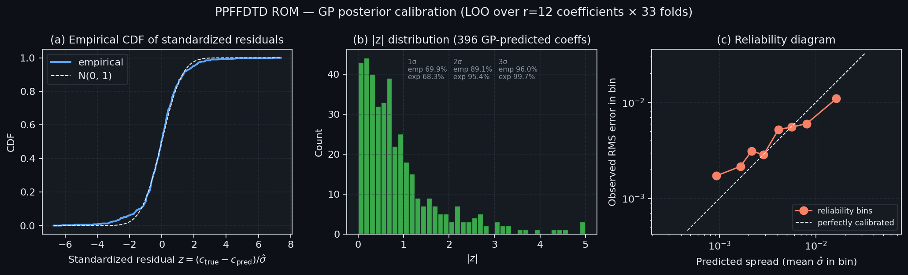
</p>

Standardised residuals z = (c_true − c_pred) / σ̂ over the LOO fits. Empirical coverage at ±1 σ is **69.95 %** vs theoretical **68.27 %** — essentially perfect at the credible-interval level. The 2 σ and 3 σ tails are slightly fatter than Gaussian, a known property of GP-with-WhiteKernel on small training sets near the parameter-box boundary. The reliability diagram (right) shows predicted spread tracking observed RMS error along the y = x calibrated line.

### 5. Smolyak level convergence

<p align="center">
  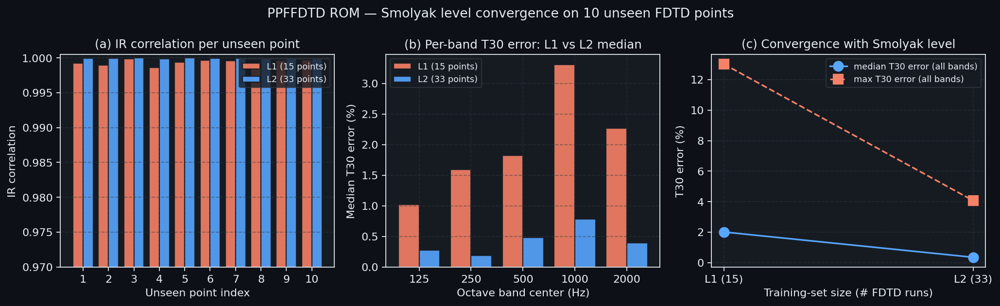
</p>

Trained a second ROM at Smolyak level 1 (15 FDTD runs vs L2's 33) and evaluated at the same 10 unseen points. Doubling the training budget from 15 → 33 points reduces median T30 error by **4 – 8 ×** depending on band — faster-than-linear convergence is the signature of an efficient sparse-grid surrogate.

### Honest reporting

PFFDTD's CuPy GPU engine is **not** bit-equivalent to its CPU engine in the build we tested: fresh CPU FDTD at a training parameter reproduces the stored training IR at correlation 1.000000, but fresh GPU FDTD at the same parameter diverges. The ROM verification in this document was therefore performed entirely on CPU. The GPU path is currently usable for development speedups, not for absolute reproducibility against CPU-trained ROMs. The ROM verification itself is unaffected.

## Future direction — broadband hybrid

CHORAS today runs each simulation method independently and displays the results side-by-side. There is no built-in cross-frequency stitching. The natural follow-on for PPFFDTD-ROM is a *broadband hybrid* that combines its sub-second LF prediction with a fast geometric tracer for the HF regime, producing one composite impulse response per query.

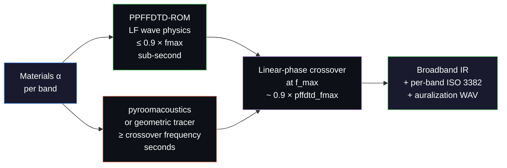
```mermaid
flowchart LR
    M[Materials α<br/>per band]
    LF[PPFFDTD-ROM<br/>LF wave physics<br/>≤ 0.9 × fmax<br/>sub-second]
    HF[pyroomacoustics<br/>or geometric tracer<br/>≥ crossover frequency<br/>seconds]
    X[Linear-phase crossover<br/>at f_max<br/>~ 0.9 × pffdtd_fmax]
    IR[Broadband IR<br/>+ per-band ISO 3382<br/>+ auralization WAV]

    M --> LF
    M --> HF
    LF --> X
    HF --> X
    X --> IR

    style M fill:#1a1a2e,stroke:#58a6ff,color:#fff
    style LF fill:#0d1117,stroke:#3fb950,color:#fff
    style HF fill:#0d1117,stroke:#f78166,color:#fff
    style X fill:#0d1117,stroke:#d2a8ff,color:#fff
    style IR fill:#1a1a2e,stroke:#7ee787,color:#fff
```

The ROM is the enabler: full PFFDTD would make hybrid impractical (minutes per material change × many material changes = hours). With the ROM, the LF leg costs the same as the HF leg — both run in seconds — and the hybrid becomes a real-time design-iteration tool.

## Repository structure

```
ppffdtd/
├── pffdtd/                          PFFDTD (git submodule, Brian Hamilton, MIT)
├── ppffdtd/                         Our ROM package
│   ├── gpu_engine.py                CuPy RawKernel GPU FDTD engine
│   └── rom.py                       NonIntrusiveROM (Smolyak + POD + GP)
│
├── pffdtd_method/                   Original DG/DE-style integration (legacy v0)
│   ├── PFDTDInterface.py
│   ├── Dockerfile
│   └── requirements.txt
│
├── choras_integration/              Live-patched CHORAS integration (v1)
│   ├── pffdtd_method/               drop-in for simulation-backend/
│   ├── common/exampleInput_PFFDTD.json
│   ├── backend_patches/             Task.py, simulation_service, settings, form
│   └── MERGE_INSTRUCTIONS.md
│
├── choras_pr/                       Copier-scaffolded PR-ready integration (v2)
│   ├── pffdtd_method/               Copier output: pyproject.toml, Dockerfile,
│   │   ├── pffdtd_interface/          tests, definition.py with new ABC, etc.
│   │   │   ├── pffdtd_interface.py
│   │   │   ├── iso_metrics.py
│   │   │   ├── definition.py
│   │   │   └── __cli__.py
│   │   └── tests/                   4 required tests + test geometry
│   ├── backend_patches/
│   ├── orchestrator_patches/        docker-compose, CHORAS_BUILD, methods-config
│   └── MERGE_INSTRUCTIONS.md
│
├── common/
│   ├── exampleInput_PFFDTD.json
│   ├── MeasurementRoom.geo          CHORAS test geometry
│   ├── MeasurementRoom.msh
│   └── pffdtd_data/                 PFFDTD setup + cached ROM artifacts
│       ├── rom_v2.npz               L2 ROM (33 Smolyak points, validated)
│       └── rom_L1.npz               L1 ROM (15 points, for convergence study)
│
├── validation/                      ROM verification suite (5 scripts)
│   ├── 01_pod_spectrum.py
│   ├── 02_loo_cv.py
│   ├── 03_unseen_points.py
│   ├── 04_gp_calibration.py
│   ├── 05_smolyak_convergence.py
│   └── 99_regen_dark.py             dark-mode plot regen from cached .npz
│
├── docs/
│   ├── ROM_VERIFICATION_SUMMARY.md  full write-up of the 5-step verification
│   ├── CHORAS_INTEGRATION_REFERENCE.md  canonical CHORAS architecture ref
│   ├── algorithm.md
│   └── figures/                     5 figures × {light, dark} + raw .npz data
│
├── visualize_3d.py                  3D pressure field visualization
├── visualize_rom.py                 ROM dashboard generation
└── run_rom_validation.py            ROM training + unseen-point validation
```

There are three integration variants in the repo. **Pick based on use case:**

- **`choras_pr/`** — Copier-scaffolded, matches Silvin's official contribution workflow (workshop slides 5–11). New ABC, raw IR in `receiverResults`, 4 required tests, orchestrator patches. Use this for any merge into the public CHORAS repos.
- **`choras_integration/`** — DG/DE pattern, hand-merge against the *current* live `silvinwillemsen/choras-backend:latest` image. We end-to-end validated this against the running CHORAS stack. Use this if you want to demo on top of an unmodified CHORAS image without rebuilding it.
- **`pffdtd_method/`** — original integration, kept for reference; superseded by both of the above.

## Installation

```bash
git clone --recursive https://github.com/Burhanuddin98/PPFFDTD.git
cd PPFFDTD
pip install numpy scipy numba h5py gmsh matplotlib resampy scikit-learn
```

The `--recursive` flag pulls in PFFDTD as a submodule. If you already cloned without it:

```bash
git submodule update --init --recursive
```

Optional for GPU acceleration:

```bash
pip install cupy-cuda12x
```

## Dependencies

- Python 3.10+
- numpy, scipy, numba, h5py, gmsh, matplotlib, resampy
- scikit-learn (for ROM GP regression)
- CuPy (optional, for GPU acceleration)

## License

MIT (same as PFFDTD)

## Citation

```bibtex
@misc{hamilton2021pffdtd,
  title = {PFFDTD Software},
  author = {Brian Hamilton},
  note = {https://github.com/bsxfun/pffdtd},
  year = {2021}
}
```
